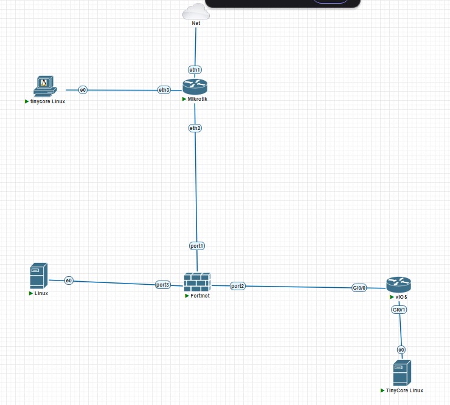
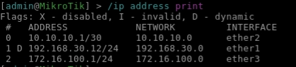
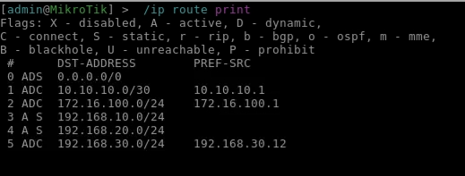
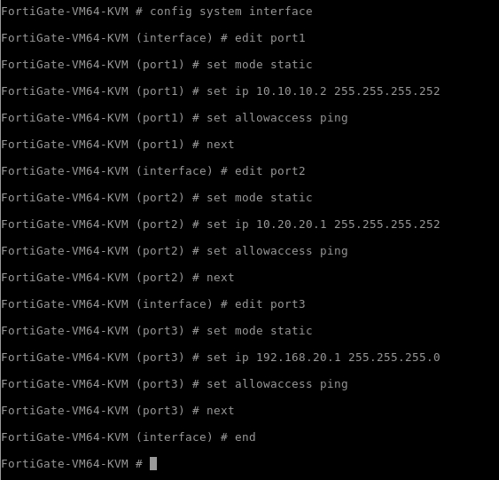
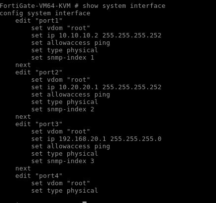
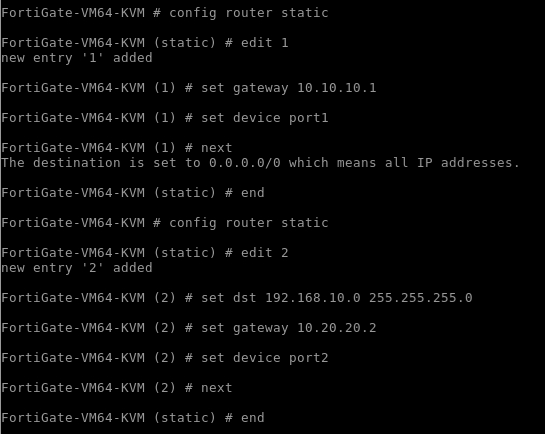
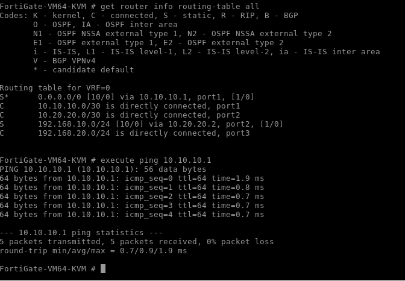

# Modul 4 - Firewall & NAT

# 1. Topologi Jaringan

Topologi yang digunakan pada praktikum ini terdiri dari MikroTik ISP, FortiGate, Cisco Router, Client LAN, Client WAN, dan Ubuntu Server yang ditempatkan pada zona DMZ.

## Screenshot Topologi



---

# 2. Tabel IP Address

| Perangkat         | Interface | IP Address       | Gateway      |
| ----------------- | --------- | ---------------- | ------------ |
| MikroTik ISP      | ether1    | DHCP Client      | DHCP Lab     |
| MikroTik ISP      | ether2    | 10.10.10.1/30    | -            |
| MikroTik ISP      | ether3    | 172.16.100.1/24  | -            |
| FortiGate         | port1     | 10.10.10.2/30    | 10.10.10.1   |
| FortiGate         | port2     | 10.20.20.1/30    | -            |
| FortiGate         | port3     | 192.168.20.1/24  | -            |
| Cisco Router      | G0/0      | 10.20.20.2/30    | -            |
| Cisco Router      | G0/1      | 192.168.10.1/24  | -            |
| Client LAN        | eth0      | 192.168.10.10/24 | 192.168.10.1 |
| Client WAN        | eth0      | 172.16.100.10/24 | 172.16.100.1 |
| Ubuntu Server DMZ | eth0      | 192.168.20.10/24 | 192.168.20.1 |

---

# 3. Konfigurasi Tiap Perangkat

## 3.1 MikroTik ISP

### Konfigurasi DHCP Client

```bash
/ip dhcp-client add interface=ether1
```

### Konfigurasi IP Address

```bash
/ip address add address=10.10.10.1/30 interface=ether2

/ip address add address=172.16.100.1/24 interface=ether3
```

### Konfigurasi NAT

```bash
/ip firewall nat add chain=srcnat out-interface=ether1 action=masquerade
```

### Konfigurasi Routing

```bash
/ip route add dst-address=192.168.10.0/24 gateway=10.10.10.2

/ip route add dst-address=192.168.20.0/24 gateway=10.10.10.2
```

### Screenshot




---

## 3.2 FortiGate

### Konfigurasi Interface

#### Port1 (WAN)

```bash
config system interface
edit port1
set ip 10.10.10.2 255.255.255.252
set allowaccess ping https ssh
next
end
```

#### Port2 (INSIDE)

```bash
config system interface
edit port2
set ip 10.20.20.1 255.255.255.252
next
end
```

#### Port3 (DMZ)

```bash
config system interface
edit port3
set ip 192.168.20.1 255.255.255.0
next
end
```

### Default Route

```bash
config router static
edit 1
set dst 0.0.0.0 0.0.0.0
set gateway 10.10.10.1
set device port1
next
end
```

### Static Route LAN

```bash
config router static
edit 2
set dst 192.168.10.0 255.255.255.0
set gateway 10.20.20.2
set device port2
next
end
```

### Screenshot






---

## 3.3 Cisco Router

### Konfigurasi Interface

```bash
enable
configure terminal

interface g0/0
ip address 10.20.20.2 255.255.255.252
no shutdown

interface g0/1
ip address 192.168.10.1 255.255.255.0
no shutdown
```

### Default Route

```bash
ip route 0.0.0.0 0.0.0.0 10.20.20.1
```

### Simpan Konfigurasi

```bash
copy running-config startup-config
```

### Screenshot


---

## 3.4 Client LAN

### Konfigurasi

| Parameter   | Nilai         |
| ----------- | ------------- |
| IP Address  | 192.168.10.10 |
| Subnet Mask | 255.255.255.0 |
| Gateway     | 192.168.10.1  |
| DNS         | 8.8.8.8       |

### Screenshot


---

## 3.5 Client WAN

### Konfigurasi

| Parameter   | Nilai         |
| ----------- | ------------- |
| IP Address  | 172.16.100.10 |
| Subnet Mask | 255.255.255.0 |
| Gateway     | 172.16.100.1  |
| DNS         | 8.8.8.8       |

### Screenshot


---

## 3.6 Ubuntu Server DMZ

### Konfigurasi IP

| Parameter  | Nilai         |
| ---------- | ------------- |
| IP Address | 192.168.20.10 |
| Gateway    | 192.168.20.1  |
| DNS        | 8.8.8.8       |

### Instalasi Nginx

```bash
apt update

apt install nginx -y
```

### Mengubah Halaman Web

```bash
nano /var/www/html/index.nginx-debian.html
```

Isi halaman:

```html
Tumod_4_DMZ_Firewall_KelompokXX
```

### Screenshot


---

# 4. Hasil Pengujian

## 4.1 Client LAN ke Cisco Router


Berhasil melakukan ping ke gateway Cisco Router.

---

## 4.2 Client LAN ke FortiGate


Berhasil melakukan ping ke FortiGate.

---

## 4.3 Client LAN ke DMZ


Berhasil melakukan ping ke Server DMZ.

---

## 4.4 Client LAN Mengakses Web DMZ


Halaman web server berhasil ditampilkan.

---

## 4.5 Client WAN ke MikroTik ISP


Ping berhasil.

---

## 4.6 Client WAN ke FortiGate


Ping berhasil.

---

## 4.7 Client WAN Mengakses Web Server DMZ


Halaman web server berhasil diakses melalui VIP FortiGate.

---

## 4.8 Client WAN Ping Client LAN


Ping gagal sesuai kebijakan firewall.

---

## 4.9 Client WAN Ping IP Asli DMZ


Ping gagal sesuai konfigurasi keamanan DMZ.

---

## 4.10 Server DMZ Ping Client LAN


Server DMZ berhasil berkomunikasi dengan jaringan LAN.

---

# 5. Analisis

Pada praktikum ini FortiGate berfungsi sebagai firewall utama yang menghubungkan jaringan WAN, LAN, dan DMZ. Routing statis yang dikonfigurasi memungkinkan komunikasi antarsegmen jaringan, sedangkan firewall policy mengatur akses yang diperbolehkan dan ditolak.

Implementasi DMZ memungkinkan server web dapat diakses dari jaringan luar tanpa membuka akses langsung ke jaringan LAN. Hal ini meningkatkan keamanan karena client WAN hanya dapat mengakses layanan yang dipublikasikan melalui Virtual IP (VIP) pada FortiGate.

Hasil pengujian menunjukkan bahwa seluruh konfigurasi berjalan sesuai dengan desain topologi. Client LAN dapat mengakses server DMZ secara langsung, sedangkan Client WAN hanya dapat mengakses web server melalui alamat publik yang diterjemahkan menggunakan mekanisme NAT dan port forwarding.

---

# 6. Kesimpulan

1. MikroTik ISP berhasil berfungsi sebagai gateway menuju jaringan luar.
2. FortiGate berhasil dikonfigurasi sebagai firewall yang menghubungkan WAN, LAN, dan DMZ.
3. Cisco Router berhasil menghubungkan jaringan internal LAN dengan FortiGate.
4. Server DMZ berhasil diakses dari Client LAN maupun Client WAN melalui konfigurasi VIP dan firewall policy.
5. Firewall berhasil membatasi akses langsung dari jaringan WAN menuju jaringan LAN dan IP asli server DMZ.
6. Implementasi NAT, routing, firewall policy, dan DMZ berjalan sesuai dengan tujuan praktikum.
