# Modul 5 - Vlan-Trunk-OSPF-MultiVendor

# 1. Topologi Jaringan

Topologi yang digunakan pada praktikum ini terdiri dari NET, MikroTik ISP, Addresiing Jakarta mulai dari Cisco Switch; Cisco Router; Mikrotik Router; Cisco Vios; Ubuntu Server; Fortigate; VPCS VLAN 20 10,Addresing Surabaya Cisco Switch; Mikrotik Router; Fortigate; VPCS VLAN 30 40 TinycoreVLAN 40. Topologi di bawah adalah simulasi jaringan enterprise menghubungkan 2 kantor pusat dan kantor cabang. Kantor pusat ada di Jakarta dan kantor cabang ada di Surabaya. 2 Kantor tersebut akan dihubungkan menggunakn teknologi Gre Tunel agar bisa saling berkomunikasi meskipun tidak dalam satu kantor.

## Screenshot Topologi

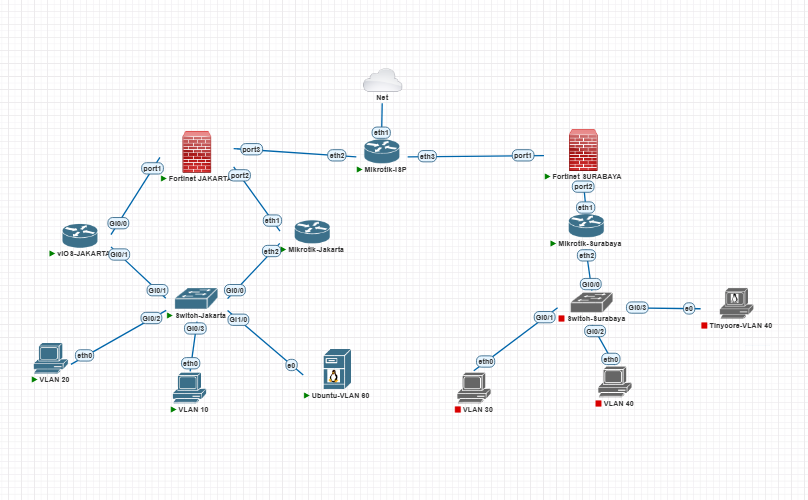

## Gambaran Topologi
### 3.1 HQ Jakarta

Sisi Jakarta terdiri dari:

* Cisco Switch Jakarta
* Cisco Router Jakarta
* MikroTik Router Jakarta
* Ubuntu Server Jakarta
* FortiGate Jakarta
* Client VLAN 10 dan VLAN 20

Cisco Router Jakarta dan MikroTik Router Jakarta digunakan sebagai dual gateway menggunakan VRRP. Ubuntu Server Jakarta digunakan sebagai DHCP Server terpusat untuk VLAN 10 dan VLAN 20. FortiGate Jakarta digunakan sebagai edge firewall, NAT gateway, dan GRE endpoint menuju Surabaya.

### 3.2 ISP

Sisi ISP disimulasikan menggunakan MikroTik RouterOS. MikroTik ISP menghubungkan FortiGate Jakarta dan FortiGate Surabaya. MikroTik ISP juga dapat dikonfigurasi NAT ke Cloud PNETLab agar perangkat internal dapat mengakses internet.

### 3.3 Branch Surabaya

Sisi Surabaya terdiri dari:

* FortiGate Surabaya
* MikroTik Router Surabaya
* Cisco Switch Surabaya
* Client VLAN 30 dan VLAN 40

FortiGate Surabaya digunakan sebagai edge firewall dan GRE endpoint. MikroTik Surabaya digunakan sebagai gateway VLAN 30 dan VLAN 40. VLAN 30 menggunakan DHCP Server dari MikroTik, sedangkan VLAN 40 menggunakan IP static.

---

# 2. Addressing Jakarta / HQ

## 2.1 VLAN Jakarta

| VLAN | Nama VLAN | Network         | Gateway Virtual | Keterangan                      |
| ---: | --------- | --------------- | --------------- | ------------------------------- |
|   10 | FINANCE   | 192.168.10.0/24 | 192.168.10.1    | DHCP dari Ubuntu Server Jakarta |
|   20 | IT        | 192.168.20.0/24 | 192.168.20.1    | DHCP dari Ubuntu Server Jakarta |
|   60 | SERVER-HQ | 192.168.60.0/24 | 192.168.60.1    | VLAN server Ubuntu Jakarta      |

---

## 2.2 IP Address Cisco Router Jakarta

| Interface |               VLAN / Link | IP Address      | Keterangan                                 |
| --------- | ------------------------: | --------------- | ------------------------------------------ |
| Gi0/1.10  |                   VLAN 10 | 192.168.10.2/24 | IP fisik Cisco untuk VLAN 10               |
| Gi0/1.20  |                   VLAN 20 | 192.168.20.2/24 | IP fisik Cisco untuk VLAN 20               |
| Gi0/1.60  |                   VLAN 60 | 192.168.60.2/24 | IP fisik Cisco untuk VLAN 60               |
| Gi0/0     | Link ke FortiGate Jakarta | 10.10.100.2/30  | Transit Cisco Jakarta ke FortiGate Jakarta |

---

## 2.3 IP Address MikroTik Router Jakarta

| Interface      |               VLAN / Link | IP Address      | Keterangan                                    |
| -------------- | ------------------------: | --------------- | --------------------------------------------- |
| vlan10-finance |                   VLAN 10 | 192.168.10.3/24 | IP fisik MikroTik untuk VLAN 10               |
| vlan20-it      |                   VLAN 20 | 192.168.20.3/24 | IP fisik MikroTik untuk VLAN 20               |
| vlan60-server  |                   VLAN 60 | 192.168.60.3/24 | IP fisik MikroTik untuk VLAN 60               |
| ether1         | Link ke FortiGate Jakarta | 10.10.101.2/30  | Transit MikroTik Jakarta ke FortiGate Jakarta |

---

## 2.4 VRRP Jakarta

| VLAN | Virtual IP   | Master                  | Backup                  | Keterangan              |
| ---: | ------------ | ----------------------- | ----------------------- | ----------------------- |
|   10 | 192.168.10.1 | Cisco Router Jakarta    | MikroTik Router Jakarta | Gateway virtual VLAN 10 |
|   20 | 192.168.20.1 | MikroTik Router Jakarta | Cisco Router Jakarta    | Gateway virtual VLAN 20 |
|   60 | 192.168.60.1 | Cisco Router Jakarta    | MikroTik Router Jakarta | Gateway virtual VLAN 60 |

---

## 2.5 Ubuntu Server Jakarta

| Perangkat             | VLAN | IP Address       | Gateway      | Service                              |
| --------------------- | ---: | ---------------- | ------------ | ------------------------------------ |
| Ubuntu Server Jakarta |   60 | 192.168.60.10/24 | 192.168.60.1 | ISC-DHCP Server dan Nginx Web Server |

---

## 2.6 DHCP Pool Jakarta

| VLAN | Network         | Range DHCP                      | Gateway yang Diberikan | DHCP Server           |
| ---: | --------------- | ------------------------------- | ---------------------- | --------------------- |
|   10 | 192.168.10.0/24 | 192.168.10.100 - 192.168.10.200 | 192.168.10.1           | Ubuntu Server Jakarta |
|   20 | 192.168.20.0/24 | 192.168.20.100 - 192.168.20.200 | 192.168.20.1           | Ubuntu Server Jakarta |

---

## 2.7 FortiGate Jakarta

| Interface   | Terhubung ke            | IP Address     | Keterangan               |
| ----------- | ----------------------- | -------------- | ------------------------ |
| port1       | Cisco Router Jakarta    | 10.10.100.1/30 | Link ke Cisco Jakarta    |
| port2       | MikroTik Router Jakarta | 10.10.101.1/30 | Link ke MikroTik Jakarta |
| port3       | MikroTik ISP            | 10.0.12.2/30   | Link WAN ke ISP          |
| GRE-JKT-SBY | FortiGate Surabaya      | 172.16.0.1/32  | IP GRE Tunnel Jakarta    |

---

# 3. Addressing ISP

## 3.1 MikroTik ISP

| Interface | Terhubung ke         | IP Address            | Keterangan              |
| --------- | -------------------- | --------------------- | ----------------------- |
| ether2    | FortiGate Jakarta    | 10.0.12.1/30          | Link ISP ke Jakarta     |
| ether3    | FortiGate Surabaya   | 10.0.13.1/30          | Link ISP ke Surabaya    |
| ether1    | Cloud NAT / Internet | DHCP / sesuai PNETLab | Akses internet simulasi |

---

## 3.2 Link WAN ISP

| Link           | Network      | Sisi A       | IP Sisi A | Sisi B             | IP Sisi B |
| -------------- | ------------ | ------------ | --------- | ------------------ | --------- |
| Jakarta ↔ ISP  | 10.0.12.0/30 | MikroTik ISP | 10.0.12.1 | FortiGate Jakarta  | 10.0.12.2 |
| ISP ↔ Surabaya | 10.0.13.0/30 | MikroTik ISP | 10.0.13.1 | FortiGate Surabaya | 10.0.13.2 |

---

# 4. Addressing Surabaya / Branch

## 4.1 VLAN Surabaya

| VLAN | Nama VLAN  | Network         | Gateway      | Keterangan                  |
| ---: | ---------- | --------------- | ------------ | --------------------------- |
|   30 | SALES      | 192.168.30.0/24 | 192.168.30.1 | DHCP dari MikroTik Surabaya |
|   40 | OPERATIONS | 192.168.40.0/24 | 192.168.40.1 | IP static manual            |

---

## 4.2 IP Address MikroTik Router Surabaya

| Interface         |                VLAN / Link | IP Address      | Keterangan                                      |
| ----------------- | -------------------------: | --------------- | ----------------------------------------------- |
| vlan30-sales      |                    VLAN 30 | 192.168.30.1/24 | Gateway VLAN 30                                 |
| vlan40-operations |                    VLAN 40 | 192.168.40.1/24 | Gateway VLAN 40                                 |
| ether1            | Link ke FortiGate Surabaya | 10.10.200.2/30  | Transit MikroTik Surabaya ke FortiGate Surabaya |

---

## 4.3 DHCP Pool Surabaya

| VLAN | Network         | Range DHCP                      | Gateway yang Diberikan | DHCP Server            |
| ---: | --------------- | ------------------------------- | ---------------------- | ---------------------- |
|   30 | 192.168.30.0/24 | 192.168.30.100 - 192.168.30.200 | 192.168.30.1           | MikroTik Surabaya      |
|   40 | 192.168.40.0/24 | Static manual                   | 192.168.40.1           | Tidak menggunakan DHCP |

---

## 4.4 IP Client Surabaya

| Client        | VLAN | IP Address       | Gateway      | Keterangan                         |
| ------------- | ---: | ---------------- | ------------ | ---------------------------------- |
| PC Sales      |   30 | DHCP             | 192.168.30.1 | Mendapat IP dari MikroTik Surabaya |
| PC Operations |   40 | 192.168.40.10/24 | 192.168.40.1 | IP static manual                   |
| PC Operations Tinycore linux |   40 | 192.168.40.20/24 | 192.168.40.1 | IP static manual                   |

---

## 4.5 FortiGate Surabaya

| Interface   | Terhubung ke      | IP Address     | Keterangan                         |
| ----------- | ----------------- | -------------- | ---------------------------------- |
| port1       | MikroTik ISP      | 10.0.13.2/30   | Link WAN ke ISP                    |
| port2       | MikroTik Surabaya | 10.10.200.1/30 | Link ke jaringan internal Surabaya |
| GRE-SBY-JKT | FortiGate Jakarta | 172.16.0.2/32  | IP GRE Tunnel Surabaya             |

---

# 5. GRE Tunnel Jakarta–Surabaya

| Tunnel      | Perangkat          | Local WAN | Remote WAN | Tunnel IP     |
| ----------- | ------------------ | --------- | ---------- | ------------- |
| GRE-JKT-SBY | FortiGate Jakarta  | 10.0.12.2 | 10.0.13.2  | 172.16.0.1/32 |
| GRE-SBY-JKT | FortiGate Surabaya | 10.0.13.2 | 10.0.12.2  | 172.16.0.2/32 |

GRE Tunnel digunakan sebagai jalur virtual antara FortiGate Jakarta dan FortiGate Surabaya. OSPF dijalankan di atas GRE Tunnel agar route jaringan Jakarta dan Surabaya dapat saling dipertukarkan secara dinamis.

---

# 6. Network yang Diiklankan melalui OSPF

## 6.1 Network Jakarta

| Network         | Keterangan              |
| --------------- | ----------------------- |
| 192.168.10.0/24 | VLAN 10 Finance Jakarta |
| 192.168.20.0/24 | VLAN 20 IT Jakarta      |
| 192.168.60.0/24 | VLAN Server Jakarta     |
| 172.16.0.1/32   | GRE Tunnel Jakarta      |

---

## 6.2 Network Surabaya

| Network         | Keterangan                  |
| --------------- | --------------------------- |
| 192.168.30.0/24 | VLAN 30 Sales Surabaya      |
| 192.168.40.0/24 | VLAN 40 Operations Surabaya |
| 172.16.0.2/32   | GRE Tunnel Surabaya         |

---

# # Tugas Modul 1 — Konfigurasi Cisco Switch Jakarta

## Perangkat yang Dikonfigurasi

Cisco Switch Jakarta.

## Bukti yang Dikumpulkan

1. Screenshot topologi Jakarta.

3. Screenshot `show vlan brief`.
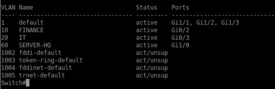
3. Screenshot `show interfaces trunk`.
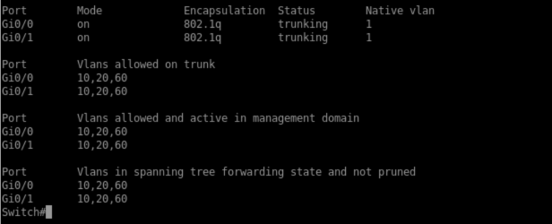

---

# Tugas Modul 2 — Konfigurasi Cisco Router Jakarta

## Perangkat yang Dikonfigurasi

Cisco Router Jakarta.

## Bukti yang Dikumpulkan

1. Screenshot `show ip interface brief`.
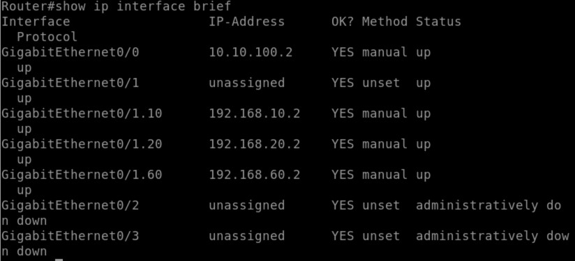
2. Screenshot `show vrrp brief`.
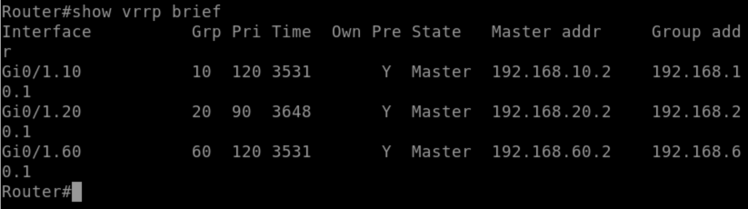
3. Screenshot konfigurasi subinterface.

4. Screenshot ping dari Cisco Router ke FortiGate Jakarta.
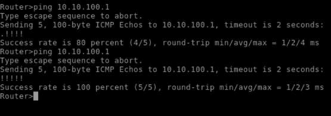

---

# Tugas Modul 3 — Konfigurasi MikroTik Router Jakarta

## Perangkat yang Dikonfigurasi

MikroTik Router Jakarta.

## Bukti yang Dikumpulkan

1. Screenshot `/ip address print`.
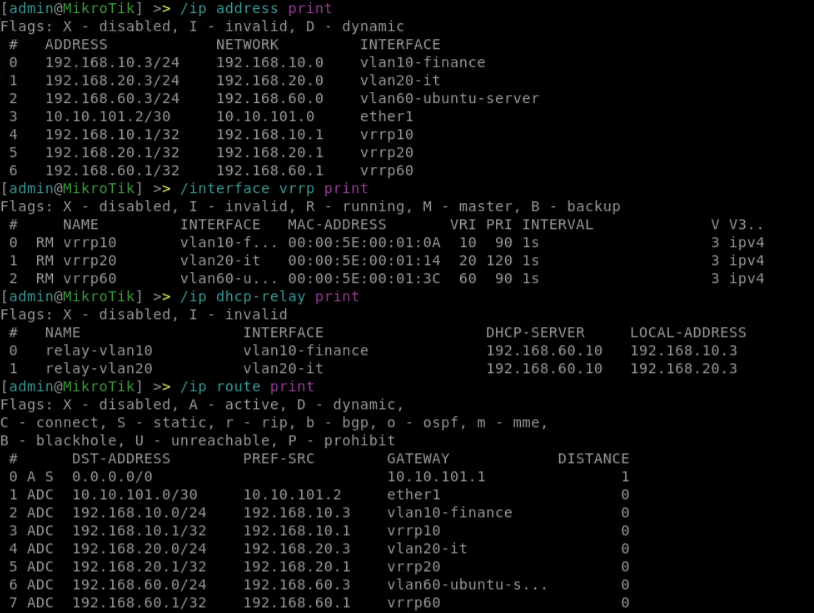 
2. Screenshot `/interface vrrp print`.

3. Screenshot `/ip dhcp-relay print`.

4. Screenshot `/ip route print`.

5. Screenshot ping dari MikroTik ke FortiGate Jakarta.
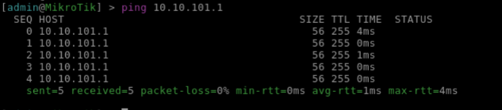
---

# Tugas Modul 4 — Konfigurasi Ubuntu Server Jakarta

## Perangkat yang Dikonfigurasi

Ubuntu Server Jakarta.

## Bukti yang Dikumpulkan

1. Screenshot `ip a`.
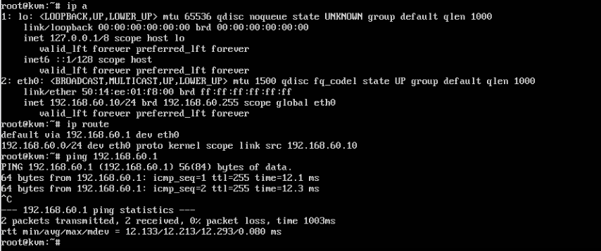  
2. Screenshot `ip route`.

4. Screenshot isi file `/etc/dhcp/dhcpd.conf`.
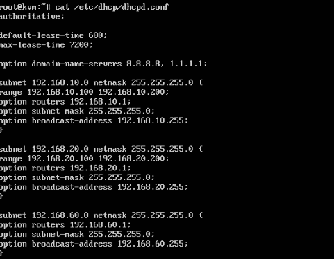
5. Sreenshot `ping 8.8.8.8`
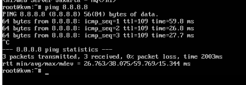
---

# Tugas Modul 5 — Konfigurasi FortiGate Jakarta

## Perangkat yang Dikonfigurasi

FortiGate Jakarta.
## Bukti yang Dikumpulkan

1. Screenshot `get system interface physical`.
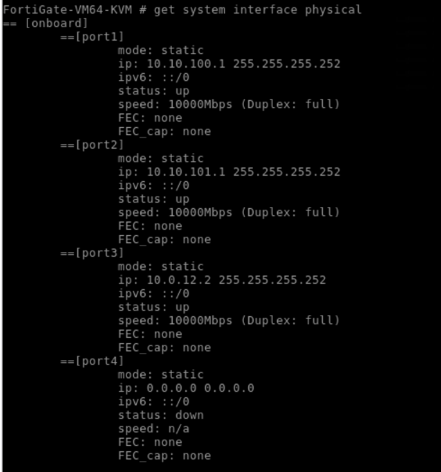
2. Screenshot `get router info routing-table all`.
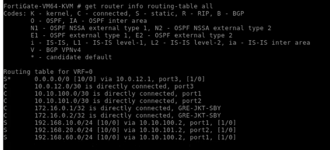
3. Screenshot firewall policy.
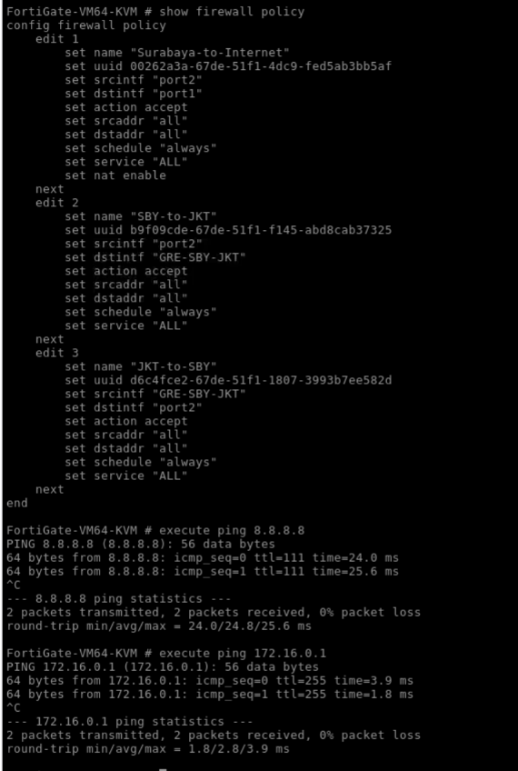
4. Screenshot ping ke 8.8.8.8.

5. Screenshot ping ke IP tunnel Surabaya.

6. Screenshot `get router info ospf neighbor`.
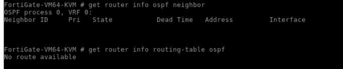  
7. Screenshot `get router info routing-table ospf`.

---
# Tugas Modul 6 — Konfigurasi MikroTik ISP

## Perangkat yang Dikonfigurasi

MikroTik ISP.

## Bukti yang Dikumpulkan

1. Screenshot `/ip address print`.
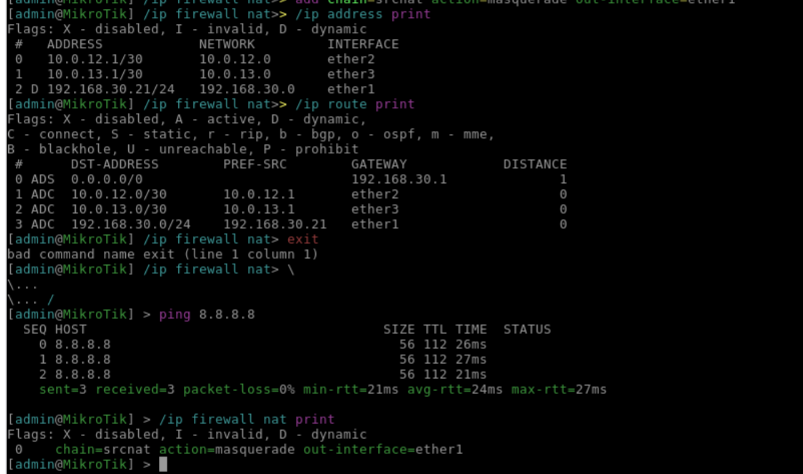
2. Screenshot `/ip route print`.

3. Screenshot `/ip firewall nat print`.

4. Screenshot ping ke 8.8.8.8.

5. Screenshot ping antar-WAN FortiGate.
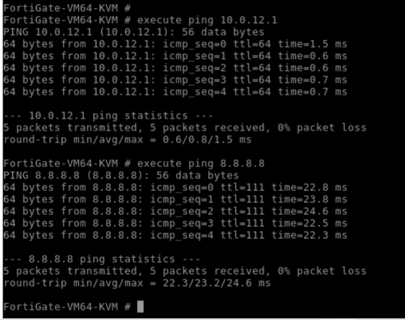
---

# Tugas Modul 7 — Konfigurasi Switch dan MikroTik Surabaya

## Perangkat yang Dikonfigurasi

Cisco Switch Surabaya dan MikroTik Router Surabaya.

## Bukti yang Dikumpulkan

1. Screenshot `show vlan brief`.
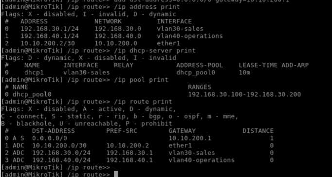
2. Screenshot `show interfaces trunk`.

3. Screenshot `/ip address print`.

4. Screenshot `/ip dhcp-server print`.

5. Screenshot `/ip pool print`.

6. Screenshot `/ip route print`.

7. Screenshot client VLAN 30 mendapat IP DHCP.
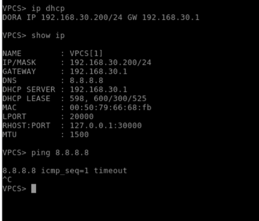
8. Screenshot ping client Surabaya ke 8.8.8.8.

---

# Tugas Modul 8 — Konfigurasi FortiGate Surabaya

## Perangkat yang Dikonfigurasi

FortiGate Surabaya..

## Bukti yang Dikumpulkan

1. Screenshot `get system interface physical`.
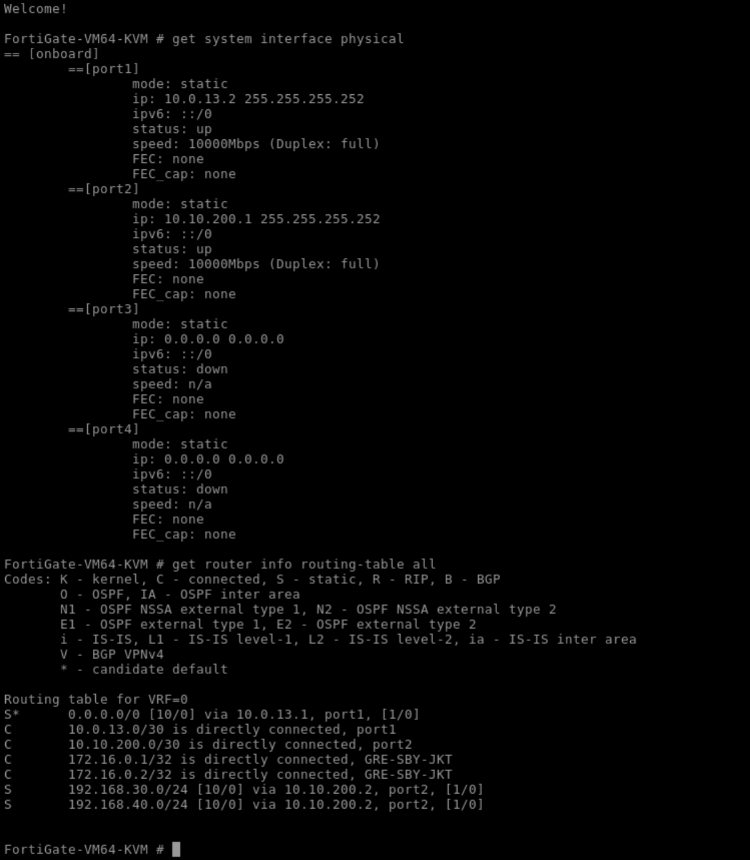
2. Screenshot `get router info routing-table all`.

3. Screenshot firewall policy.

4. Screenshot ping ke 8.8.8.8.

5. Screenshot ping ke IP tunnel Jakarta.

6. Screenshot `get router info ospf neighbor`.
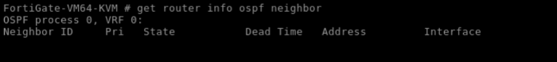
7. Screenshot `get router info routing-table ospf`.
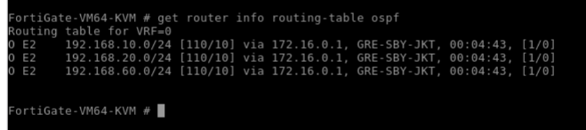

---

# Tugas Modul 9 — Konfigurasi GRE Tunnel dan OSPF over GRE

## Perangkat yang Dikonfigurasi

FortiGate Jakarta dan FortiGate Surabaya.

## Bukti yang Dikumpulkan

1. Screenshot ping WAN antar-FortiGate.
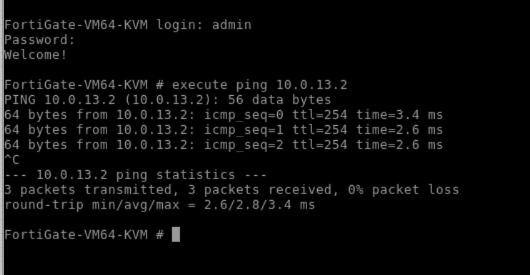
2. Screenshot ping tunnel antar-FortiGate.
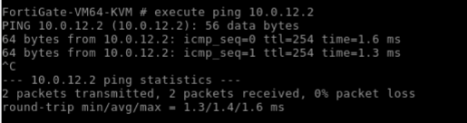
3. Screenshot `get router info ospf neighbor`.
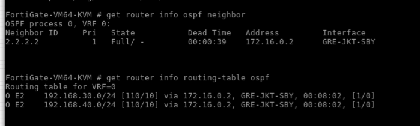
4. Screenshot `get router info routing-table ospf`.

5. Screenshot ping client Jakarta ke client Surabaya.
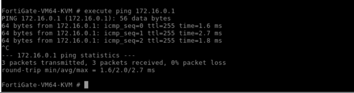
6. Screenshot ping client Surabaya ke client Jakarta.
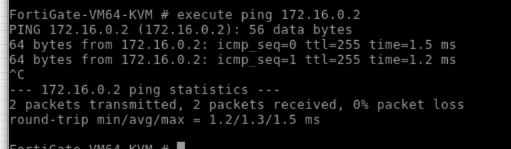

---

# Tugas Modul 10 — Pengujian Akhir

## Perangkat yang Diuji

Seluruh perangkat pada topologi.

## Hal yang Harus Diuji

1. Client VLAN 10 Jakarta mendapat IP DHCP dari Ubuntu Server.
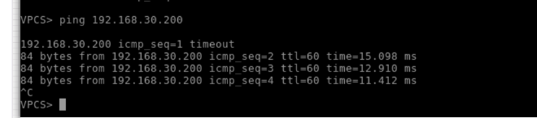
2. Client VLAN 20 Jakarta mendapat IP DHCP dari Ubuntu Server.
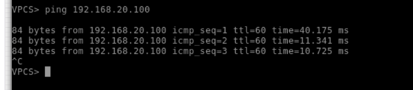
3. Client VLAN 30 Surabaya mendapat IP DHCP dari MikroTik Surabaya.
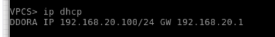
4. Client VLAN 40 Surabaya menggunakan IP static.

5. Client Jakarta dapat ping 8.8.8.8.
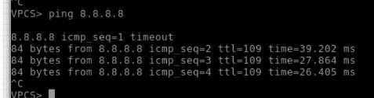
6. Client Surabaya dapat ping 8.8.8.8.
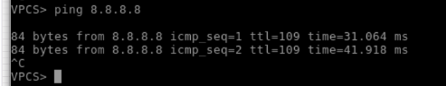
9. Client Jakarta dapat ping client Surabaya.

10. Client Surabaya dapat ping client Jakarta.

11. Client Surabaya dapat mengakses web server Jakarta.

---

# 4. Hasil Pengujian

1. Screenshot IP DHCP client Jakarta (Vlan 10).

2. Screenshot IP DHCP client Surabaya (Vlan 20).

3. Screenshot ping internet dari Jakarta.

4. Screenshot ping internet dari Surabaya.

5. Screenshot ping antar-site
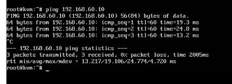
6. Screenshot akses web server Jakarta dari Surabaya.
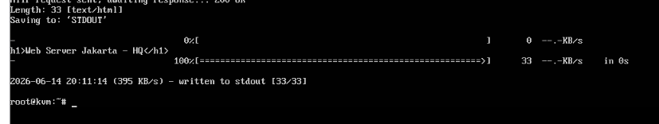
7. Screenshot routing table OSPF.
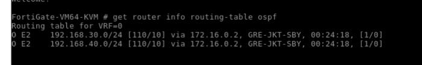

8.  Analisis singkat jalur traffic Jakarta ke Surabaya.

Ketika client di jaringan Jakarta (misalnya VLAN 10/20/60) mengirim paket menuju client di Surabaya (VLAN 30/40), paket pertama-tama diteruskan ke gateway VRRP aktif (Cisco Router atau MikroTik Router Jakarta, tergantung VLAN). Gateway tersebut meneruskan paket ke FortiGate Jakarta melalui link transit (port1/port2). Di FortiGate Jakarta, paket dicocokkan dengan routing table OSPF yang berisi network 192.168.30.0/24 dan 192.168.40.0/24 yang diiklankan oleh FortiGate Surabaya sebagai rute OSPF external type 2 (E2) melalui GRE Tunnel (172.16.0.2). Paket kemudian dienkapsulasi dan dikirim melalui GRE Tunnel ke FortiGate Surabaya.
Setibanya di FortiGate Surabaya, paket di-dekapsulasi dan diteruskan ke MikroTik Router Surabaya melalui port2 (10.10.200.0/30), sesuai static route yang dikonfigurasi untuk network 192.168.30.0/24 dan 192.168.40.0/24. MikroTik Surabaya kemudian meneruskan paket ke VLAN tujuan (VLAN 30 atau VLAN 40) melalui interface gateway-nya hingga sampai ke client tujuan.
Sebaliknya, paket balasan (reply) dari client Surabaya akan melewati jalur yang sama secara terbalik: MikroTik Surabaya → FortiGate Surabaya → GRE Tunnel → FortiGate Jakarta → Cisco/MikroTik Jakarta (gateway VRRP) → client Jakarta. Seluruh proses routing antar-site ini berjalan secara dinamis berkat OSPF yang dijalankan di atas GRE Tunnel, dengan redistribute static route yang memastikan network internal masing-masing site saling dikenali sebagai rute OSPF E2.

---

# 5. Analisis

Pada tugas modul 5, praktikan mengkonfigurasi FortiGate Jakarta sebagai edge firewall, NAT gateway, dan penghubung GRE tunnel ke Surabaya. Berdasarkan hasil konfigurasi yang telah dilakukan, FortiGate Jakarta memiliki tiga interface fisik yang aktif. Port1 dengan alamat 10.10.100.1/30 terhubung ke Cisco Router Jakarta, port2 dengan alamat 10.10.101.1/30 terhubung ke MikroTik Router Jakarta, dan port3 dengan alamat 10.0.12.2/30 terhubung ke MikroTik ISP sebagai link WAN.

Penggunaan subnet /30 pada ketiga link menunjukkan efisiensi alamat IP untuk koneksi point-to-point. Dua interface menuju Cisco dan MikroTik Jakarta mendukung desain redundansi gateway karena kedua router tersebut menjalankan VRRP. Sementara port3 sebagai link WAN menempatkan FortiGate sebagai pintu keluar masuk traffic menuju internet.

Dari sisi routing, FortiGate Jakarta memerlukan default route menuju MikroTik ISP agar traffic internet dapat keluar. Selain itu, static route ke jaringan internal Jakarta (VLAN 10, 20, 60) perlu ditambahkan meskipun FortiGate terhubung langsung ke subnet transit, karena static route memastikan FortiGate mengetahui cara menjangkau network di belakang router Cisco dan MikroTik. Kemudian, redistribute static ke OSPF akan menyebarkan rute jaringan Jakarta ke Surabaya melalui GRE tunnel.

GRE tunnel dibangun antara FortiGate Jakarta dan FortiGate Surabaya dengan menggunakan alamat WAN masing-masing, yaitu 10.0.12.2 dan 10.0.13.2. Tunnel diberikan alamat 172.16.0.1/32 di sisi Jakarta dan 172.16.0.2/32 di sisi Surabaya. Penggunaan alamat /32 adalah praktik umum karena tunnel merupakan logical point-to-point link. Keberhasilan tunnel sangat bergantung pada konektivitas WAN antar FortiGate melalui ISP dan tidak adanya NAT yang mengubah source atau destination IP pada jalur tersebut.

OSPF dijalankan di atas GRE tunnel dengan area backbone 0. Redistribute static diaktifkan pada kedua FortiGate sehingga jaringan di belakang masing-masing firewall dapat diiklankan secara dinamis. Hal ini memudahkan penambahan VLAN di masa depan tanpa konfigurasi manual di sisi lain.

Firewall policy yang harus ada meliputi aturan untuk traffic internal Jakarta menuju internet dengan tindakan accept dan NAT diaktifkan. Sementara traffic internal Jakarta menuju Surabaya melalui GRE tunnel juga diizinkan namun tanpa NAT karena komunikasi antar-site menggunakan alamat private yang sudah dikenal. Kebijakan ini memisahkan secara jelas antara traffic internet dan traffic site-to-site.

---

# 6. Kesimpulan

1. MikroTik ISP berhasil berfungsi sebagai gateway utama yang menghubungkan jaringan enterprise ke internet serta menghubungkan FortiGate Jakarta dan FortiGate Surabaya melalui link WAN.
2. VRRP antara Cisco Router Jakarta dan MikroTik Router Jakarta berhasil dikonfigurasi, dengan Cisco sebagai master untuk VLAN 10 dan 60 serta MikroTik sebagai master untuk VLAN 20, sehingga menyediakan redundansi gateway di sisi kantor pusat.
3. Ubuntu Server Jakarta berhasil berfungsi sebagai DHCP server terpusat untuk VLAN 10 dan VLAN 20, serta sebagai web server yang dapat diakses dari jaringan Surabaya.
4. Cisco Router dan MikroTik Router Jakarta berhasil dikonfigurasi sebagai DHCP relay, sehingga permintaan IP dari client di VLAN 10 dan 20 dapat diteruskan ke Ubuntu Server di VLAN 60.
5. FortiGate Jakarta dan FortiGate Surabaya berhasil dikonfigurasi sebagai firewall, NAT gateway, dan endpoint GRE tunnel, dengan kebijakan firewall yang memisahkan traffic internet dan traffic antar-site.
6. GRE tunnel antara FortiGate Jakarta dan FortiGate Surabaya berhasil dibangun dan aktif, dibuktikan dengan keberhasilan ping antar alamat tunnel 172.16.0.1 dan 172.16.0.2.
7. OSPF over GRE berjalan dengan sukses, ditandai dengan status neighbor full dan redistribusi rute statis sehingga rute jaringan Jakarta (192.168.10.0/24, 192.168.20.0/24, 192.168.60.0/24) muncul di tabel routing FortiGate Surabaya, dan sebaliknya.
8. Client pada VLAN 10 dan VLAN 20 di Jakarta berhasil mendapatkan alamat IP dari DHCP server Ubuntu, client VLAN 30 di Surabaya mendapat IP dari DHCP server MikroTik, dan client VLAN 40 menggunakan IP statis sesuai ketentuan.
9. Seluruh client baik di Jakarta maupun Surabaya berhasil mengakses internet melalui ping ke 8.8.8.8, menunjukkan konfigurasi NAT dan firewall policy pada FortiGate berfungsi dengan baik.
10. Konektivitas antar-site teruji berhasil, dibuktikan dengan ping dari client VLAN 10 Jakarta ke client VLAN 40 Surabaya dan akses web server Jakarta dari client Surabaya melalui browser.
11. Implementasi VRRP, DHCP relay, GRE tunnel, OSPF over GRE, serta firewall policy secara keseluruhan berjalan sesuai dengan tujuan praktikum, menghasilkan jaringan enterprise yang resilien, terpusat, dan terhubung secara dinamis.
